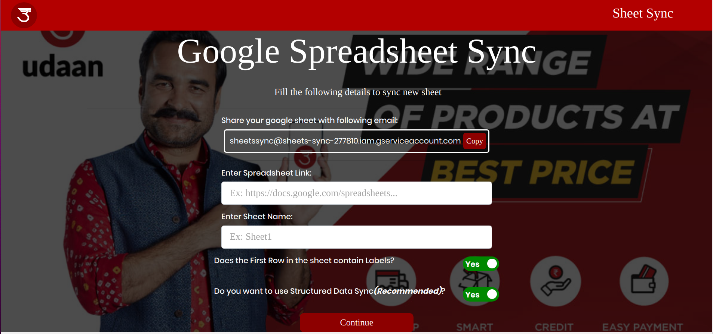

# Sync Google Spreadsheets with SQLITE Database

#### _Application is still in development_
#### _Backend Service has been Implemented_
### Stack Used
1. Kotlin with DropWizard Framework
2. SQLite3 Database
3. ReactJS with REDUX


## Steps to Run the code
1. Create google service account and add credentials to 
    `src/main/resources/credentials.json`  
2. Now in project home directory run
`./gradlew run`
3. As the Frontend has not been built yet content must be downloaded from API calls directly
`http://localhost:8000/api/enter`
4. Before entering the sheet link make sure that Google sheet is shared with service account as editor
5. This below is example API I have used for testing Structured Sync
```
spreadSheetLink: https://docs.google.com/spreadsheets/d/1PguPam6ErISvdrzpfMLck7e72MgklC7MFFvlHJzesO0/edit#gid=883250178
sheetName: Sheet1
columns: [Product No,category,Name,Quantity, Price,Product Image]
types: [integer,varchar(200),varchar(200),varchar(50),varchar(50),varchar(200)]
withLabel: true
structured: true
```
6. You can also use un-structured sync as follows
_In this case rest of the work is taken care by Application itself, but is not as optimizable as structured_
```
spreadSheetLink: https://docs.google.com/spreadsheets/d/1vNgROdBY1fq2vf_k5xRaN0SXG8_bMl4gJEsKAsRzPek/edit#gid=0
sheetName: Sheet1
withLabel: false
structured: false
```
7. On running the gradle server and using curl or postman to send the POST request with above Body
8. Note that above is just a format, you may have to change them based on your credentials

#### _Now this might look tedious but once frontend is done users just have to enter the names of columns and choose type from a neat dropdown menu_
